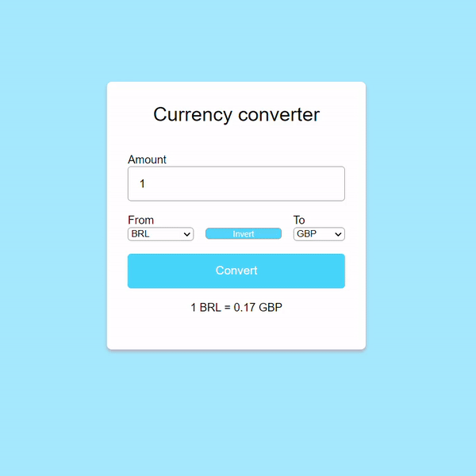

# App Web Currency Converter 💱

Esse app é desenvolvido em linguagem Javascript, HTML e CSS. A principal função é mostrar a **cotação** em tempo real da conversão de uma moeda (Exemplo, cotação do Dólar em Real). Inicialmente, é possível saber o câmbio entre 4 moedas, são elas:

 - Dólar (USD)
 - Real (BRL)
 - Libra Esterlina (GBP)
 - Euro (EUR)

This app is developed using JavaScript, HTML, and CSS. The main function is to show the exchange rate in real time (for example, the dollar price in BRL). Initially, it's possible to know the exchange between 4 currencies:

 - Dollar (USD)
 - Real (BRL)
 - Sterling Pound (GBP)
 - Euro (EUR)

## Demo

    

